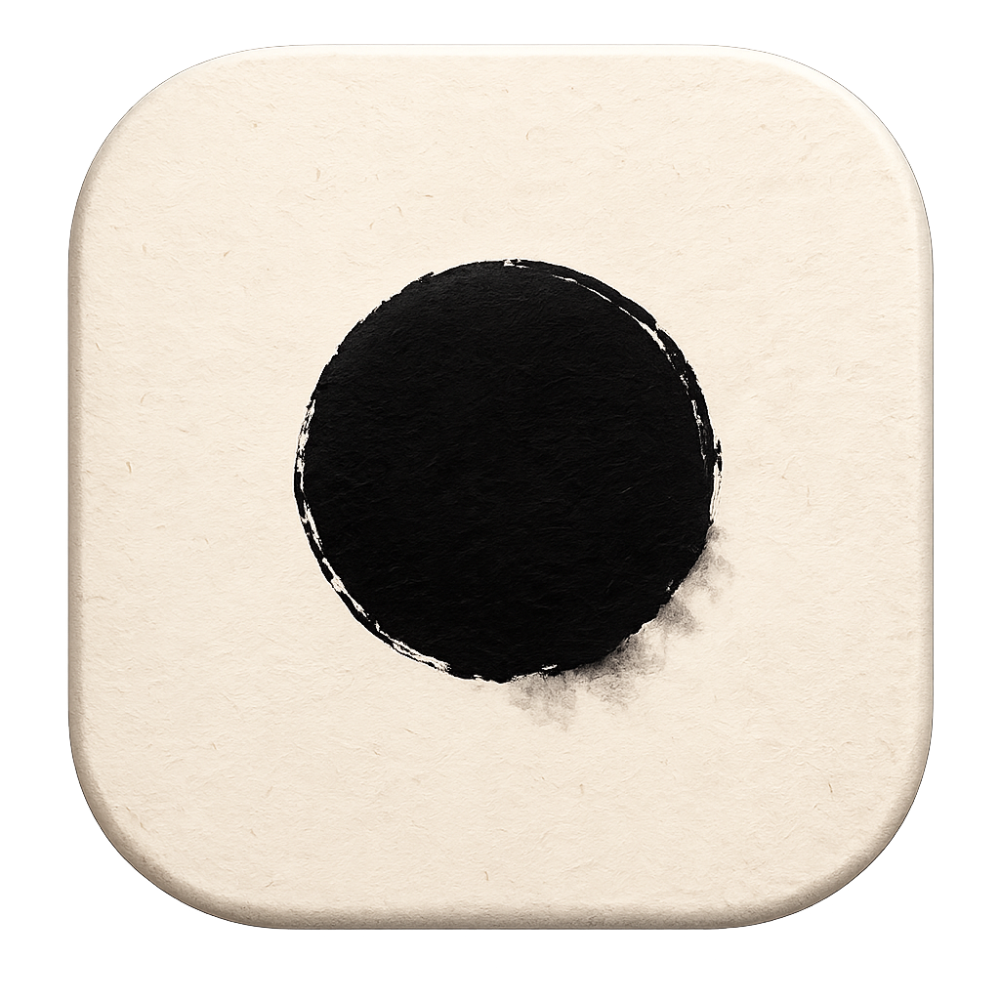
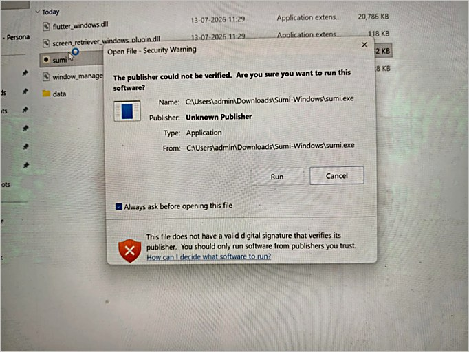
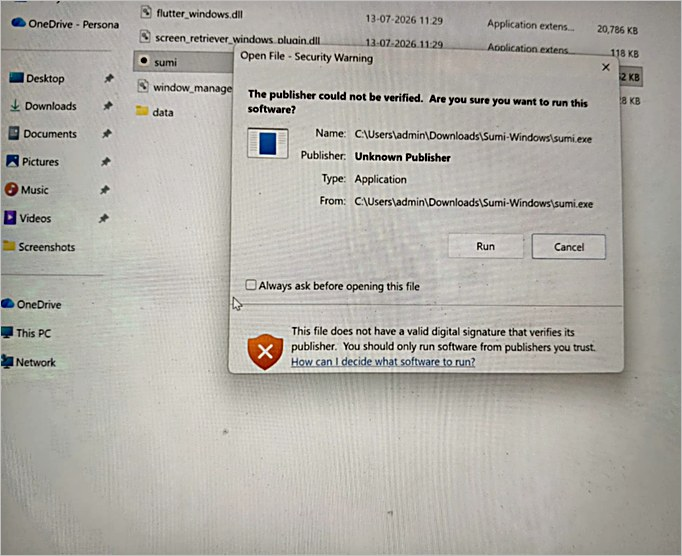

<p align="center">
  
</p>

<h1 align="center">Sumi</h1>

<p align="center"><em>A single calm point of focus.</em></p>

---

Sumi is a premium, distraction-free focus app. It removes everything
from your screen and presents one thing: a small ink mark on a quiet
sheet of paper, for the duration of a session. Pressing Begin takes
over the full screen — nothing else competes for your attention.

Everything you see is drawn by the app itself — the paper, its
texture, the ink mark (subtly unique on every launch). No accounts, no
analytics, no network access. Your preferences never leave your device.

## Focus practices

- **Focus Preparation** *(default)* — a short guided breathing arrival
  that settles, almost imperceptibly, into silent visual fixation.
- **Visual Focus** — a completely stationary fixation point. No
  animation, no text, no interruptions.
- **Guided Breathing** — the mark gently expands and contracts,
  pacing slow, even breathing for the whole session. The rhythm is
  fully adjustable.

Sessions run from 1 minute to 4 hours, with two appearances — warm
**Paper** and dark **Slate** — an optional quiet timer, and a
deliberate exit (Esc, three times) so a stray key never breaks focus.

## Platforms

| Platform | Requirements | Download |
| --- | --- | --- |
| macOS | Apple Silicon, macOS 14+ | `Sumi-macOS.dmg` |
| Windows | Windows 10/11, x64 | `Sumi-Windows.zip` |

## Download

<p>
  <a href="../../releases/latest"></a>
  
</p>

**[⬇ Get the latest release](../../releases/latest)** — both platform
downloads are attached to every release.

> **Beta status:** Sumi is in active beta. Builds are not yet signed or
> notarized, so both operating systems show a one-time security warning
> — see below. Signed builds will remove these steps.

### Install on macOS

1. Download **Sumi-macOS.dmg** and open it.
2. Drag **Sumi** into **Applications**.
3. First launch only — macOS will say it *"could not verify Sumi is
   free of malware"* because the beta is not notarized with Apple.
   Either:
   - Open **System Settings → Privacy & Security**, scroll down, and
     click **Open Anyway** next to the Sumi message, **or**
   - run this once in Terminal:

     ```sh
     xattr -cr /Applications/Sumi.app
     ```

4. Open Sumi normally from then on.

### Install on Windows

1. Download **Sumi-Windows.zip** and extract it fully (don't run from
   inside the zip).
2. Run **sumi.exe**.
3. First launch — Windows shows one of two warnings for unsigned beta
   apps; both are one-time if handled as below:
   - **"The publisher could not be verified"** — untick
     **"Always ask before opening this file"**, then click **Run**.
     With the box unticked, the warning never appears again.
   - **SmartScreen "Windows protected your PC"** — click
     **More info → Run anyway**.

   <details>
   <summary>What the warning looks like</summary>
   <br>
   <p align="center">
     
     <br><br>
     
   </p>
   </details>

## Privacy

Sumi collects nothing. No analytics, no telemetry, no tracking, no
network access.

## Feedback

Suggestions, questions, or anything unclear — we'd love to hear from
you: **hello.syvryn@gmail.com**

---

<p align="center">Developed by <strong>Syvryn Labs</strong></p>
